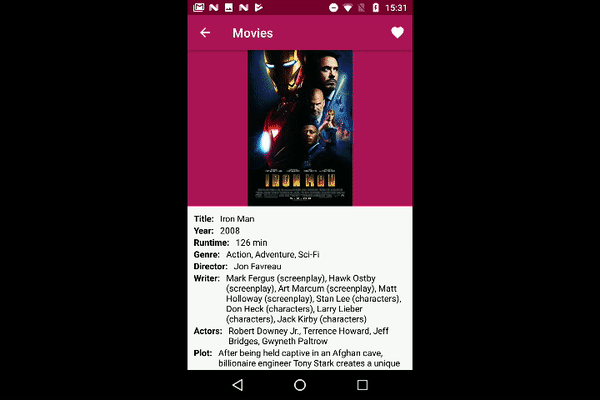

# Movies

## This app saves informations about your favorite movies.

#### The Android application uses MVVM Live Kotlin

    
    

### API

OMDb API (http://www.omdbapi.com/)

### Third-party libraries
* [Retrofit](https://square.github.io/retrofit/) for network
* [Glide](https://github.com/bumptech/glide) for downloading and caching images.

